# Multimedia Projects

Games, animation and video work from my bachelor's and master's programmes. Playable builds are on
[dshiryu.itch.io](https://dshiryu.itch.io/). Each game folder holds the full project source; large
third-party packs are not committed and are listed in each folder's `THIRD_PARTY.md`.

| Project | Engine | Play | Source |
|---|---|---|---|
| [IPA Quest](#ipa-quest) | Unity 2022.3 | [itch.io](https://dshiryu.itch.io/ipa-quest) | [`ipa-quest/`](ipa-quest/) |
| [NewVRDrums](#newvrdrums) | Unreal 5.5 (VR) | [itch.io](https://dshiryu.itch.io/newvrdrums) | [`newvrdrums/`](newvrdrums/) |
| [LAGAGA](#lagaga) | Unreal 5 | [itch.io](https://dshiryu.itch.io/lagaga) | [`lagaga/`](lagaga/) |
| [OpenGL Game Prototype](#opengl-game-prototype) | C++ / OpenGL | | [separate repo](https://github.com/allan-valin/OpenGL_Game_Prototype) |
| [Pure Data GPS tour](#pure-data-gps-tour) | Pure Data | | [separate repo](https://github.com/allan-valin/puredata_gps_tour_running) |
| [Blender short](#blender-short) | Blender | [YouTube](https://youtu.be/PU85iHkLb8Q) | [`blender-animation/`](blender-animation/) |
| [AV production](#av-production) | DaVinci Resolve | [YouTube](https://youtu.be/4o1PCR2Bwsg) | [`av-production/`](av-production/) |
| [PokeType](#poketype) | Java | | [`poketype/`](poketype/) |
| [Photography](#photography) | Nikon, HDR | | [`photography/`](photography/) |

## IPA Quest

A Metroidvania where you collect the symbols of the International Phonetic Alphabet (IPA). Each symbol
plays its sound when picked up. Built in Unity following a Hollow-Knight-style Metroidvania tutorial
series, then extended with the IPA collection mechanic, bosses and a persistent world.

Development, in order:

Design document: [`ipa-quest/docs/IPA Quest.docx`](ipa-quest/docs/IPA%20Quest.docx). Full playthrough: to be recorded.

## NewVRDrums

A VR drumming game inspired by Rock Band. Training stages, an air-drumming stage and two stages that
demand precise rhythm, with 30+ patterns from different music styles. Unreal Engine 5.5, OpenXR, Blueprints.

Development, in order:

## LAGAGA

A Galaga clone with a roguelike flavour. The first three levels reproduce the original patterns and
introduce the mechanics; from level 4 the player earns an upgrade (fire rate, multishot, bombs, ...)
for every 10 kills. Unreal Engine 5, Blueprints.

Early version, final version:

## OpenGL Game Prototype

Game for the Computer Graphics course (master's, Hochschule Fulda), written from scratch in C++ and OpenGL.
Source: [OpenGL_Game_Prototype](https://github.com/allan-valin/OpenGL_Game_Prototype).

Early build, late build:

## Pure Data GPS tour

Prototype in Pure Data that plays audio files when the runner reaches given GPS coordinates, in the
spirit of VoiceMap and Zombies, Run!. Source: [puredata_gps_tour_running](https://github.com/allan-valin/puredata_gps_tour_running).

## Blender short

Short animated film for the 3D modelling course. I modelled and animated the segment between 0:30 and
1:00 and edited all the cuts together. The `.blend` scene and credits are in [`blender-animation/`](blender-animation/)
(models excluded for size).

## AV production

Group short film for the audiovisual production course. In order: story idea, storyboard (mine),
rough cut (mine), final version. Storyboard and shot order are in [`av-production/`](av-production/).

## PokeType

Small Java tool to check type weaknesses for competitive Pokémon battling. Unlike most calculators it
lets you stack more than two types, since some moves add a third type. Run `poketype/PokeType.jar`
(antivirus may flag the JAR as a false positive).

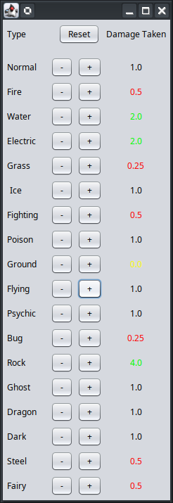

## Photography

Environment shots from the digital photography course (2023), mostly HDR merges of 3 to 5 exposures at
ISO 100, f/8. Web-sized copies (2000 px); click for the larger version.

<table><tr><td><a href="photography/DSC_0068-HDR.jpg">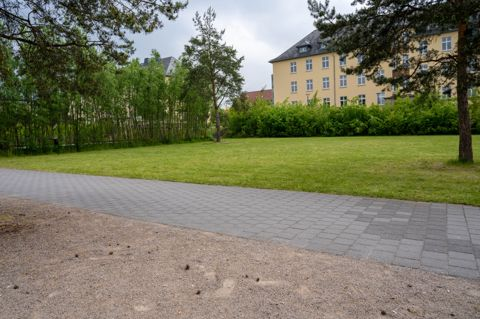</a></td><td><a href="photography/DSC_0071-HDR.jpg">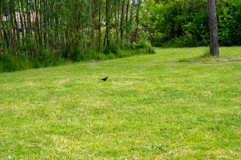</a></td><td><a href="photography/DSC_0074-HDR.jpg">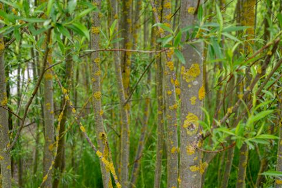</a></td><td><a href="photography/DSC_0083-HDR.jpg">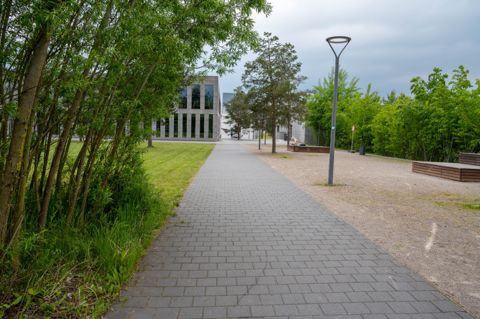</a></td></tr><tr><td><a href="photography/DSC_0086-HDR.jpg">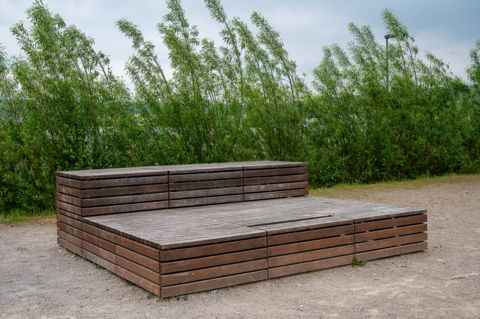</a></td><td><a href="photography/DSC_0089-HDR.jpg">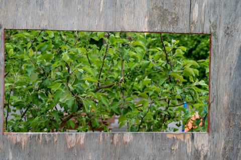</a></td><td><a href="photography/DSC_0095-HDR.jpg">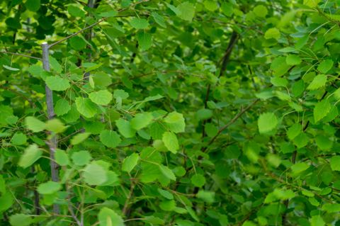</a></td><td><a href="photography/DSC_0101-HDR.jpg">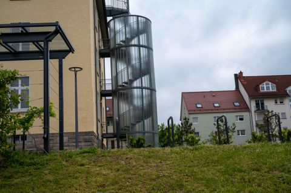</a></td></tr><tr><td><a href="photography/DSC_0110-HDR-2.jpg">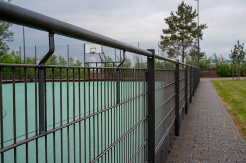</a></td><td><a href="photography/DSC_0116-HDR.jpg">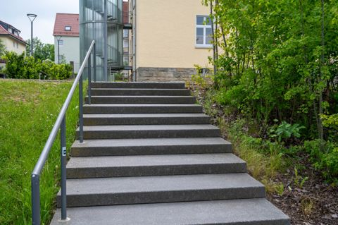</a></td><td><a href="photography/DSC_0119-HDR.jpg">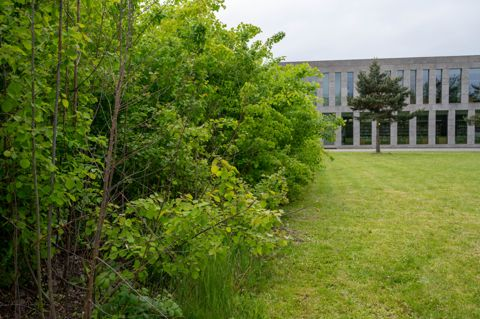</a></td><td><a href="photography/DSC_0122-HDR.jpg">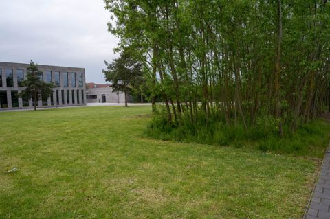</a></td></tr><tr><td><a href="photography/DSC_0125-HDR.jpg">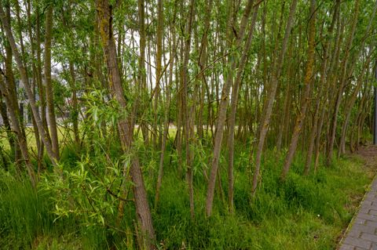</a></td><td><a href="photography/DSC_0131-HDR.jpg">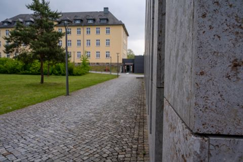</a></td><td><a href="photography/DSC_0133-HDR.jpg">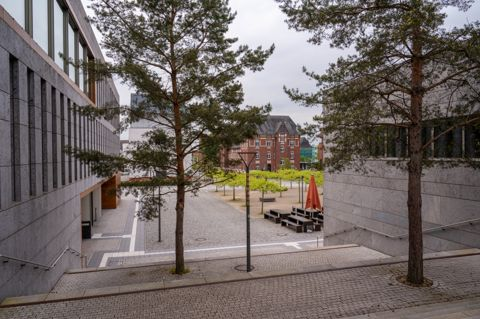</a></td><td><a href="photography/DSC_0142-HDR.jpg">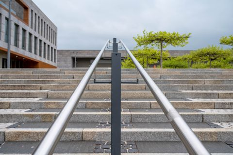</a></td></tr><tr><td><a href="photography/DSC_0145.jpg">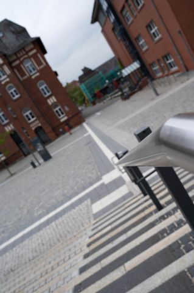</a></td><td><a href="photography/DSC_0147-HDR.jpg">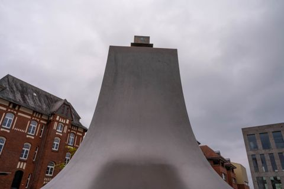</a></td><td><a href="photography/JON_3248-HDR.jpg">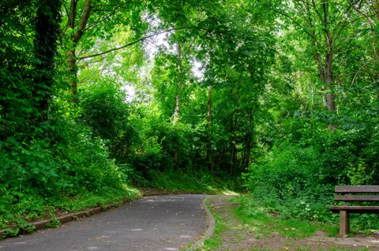</a></td><td><a href="photography/JON_3279-HDR.jpg">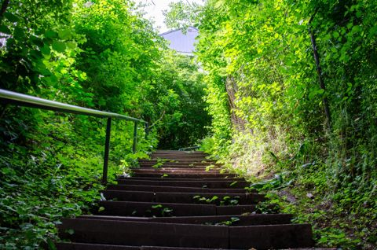</a></td></tr><tr><td><a href="photography/JON_3476.jpg">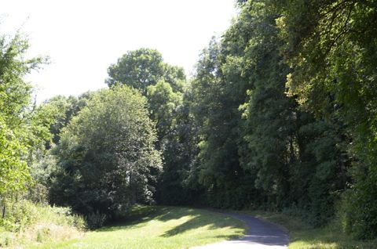</a></td><td><a href="photography/JON_3758-HDR.jpg">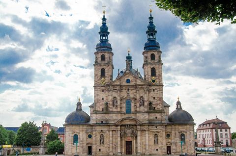</a></td></tr></table>
